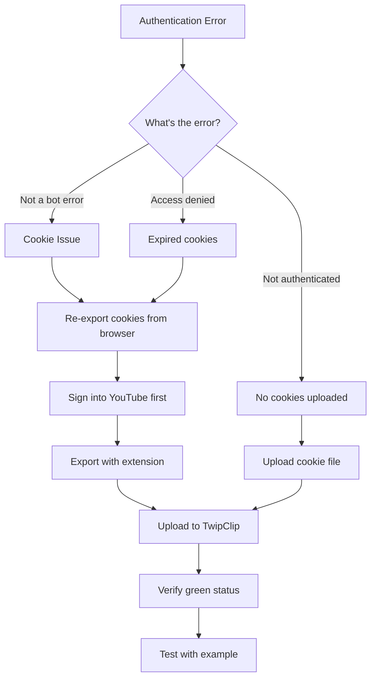
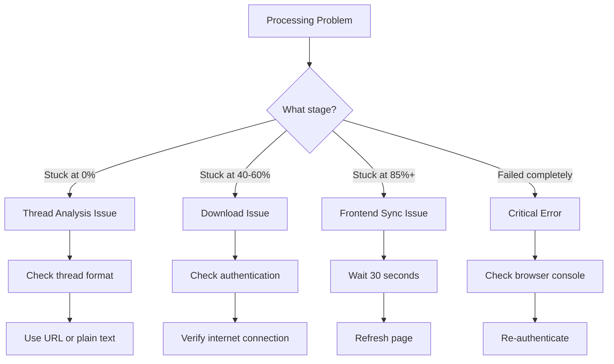
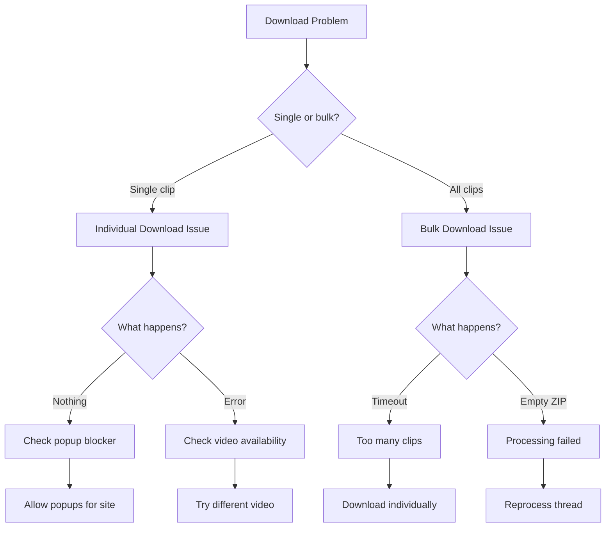
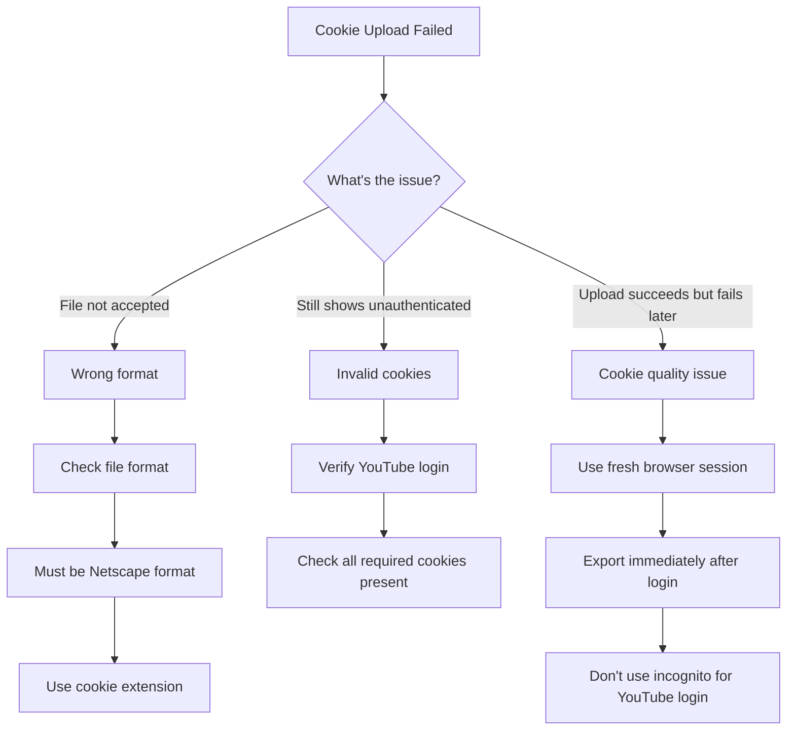

# TwipClip Troubleshooting Flowchart

## Quick Visual Troubleshooting Guide

### Authentication Issues

### Processing Issues

### Download Issues

### Cookie Upload Issues

## Common Solutions Reference

### 🔑 Authentication Solutions
1. **Always sign into YouTube first**
2. **Export cookies immediately after login**
3. **Use recommended browser extensions**
4. **Re-export daily for best results**

### ⚡ Performance Solutions
1. **Process one thread at a time**
2. **Break long threads into parts**
3. **Avoid peak hours (evenings/weekends)**
4. **Use faster AI models for testing**

### 🛠️ Technical Solutions
1. **Clear browser cache**
2. **Disable ad blockers**
3. **Check console for errors**
4. **Verify all dependencies installed**

### 📱 Browser-Specific Tips

**Chrome/Edge:**
- Use EditThisCookie extension
- Enable third-party cookies
- Disable enhanced tracking protection for YouTube

**Firefox:**
- Use Cookie Quick Manager
- Set privacy to Standard (not Strict)
- Allow YouTube in exceptions

**Safari:**
- Use Develop menu for cookie export
- Disable "Prevent cross-site tracking"
- May need manual cookie formatting

## When All Else Fails

1. **Test with the example button first**
2. **Try a different browser**
3. **Check if YouTube works normally in your browser**
4. **Restart the application**
5. **Check the [debug script](../scripts/debug-cookies.js)**

---

For detailed explanations, see the full [User Guide](../USER_GUIDE.md) 